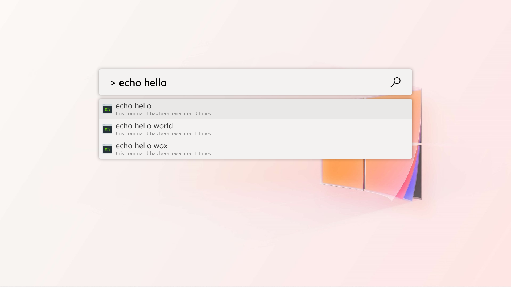
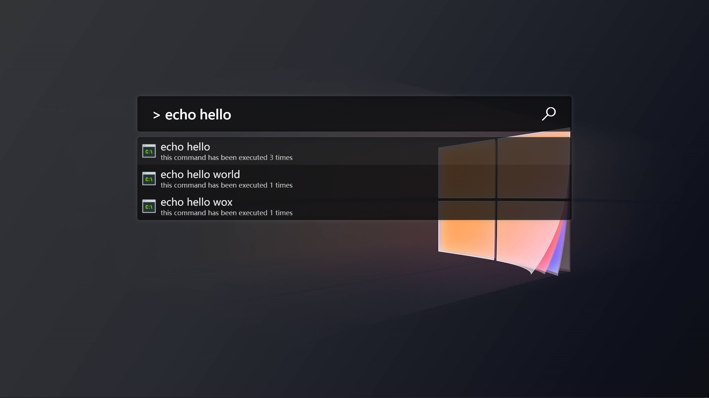
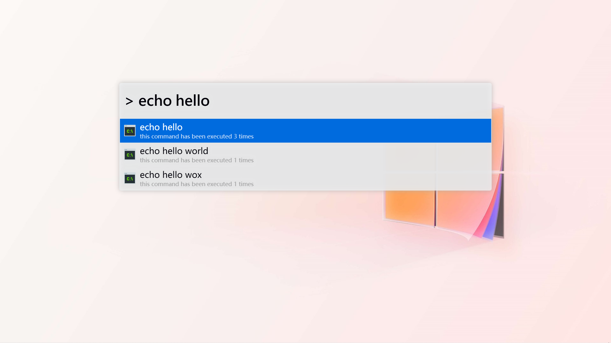
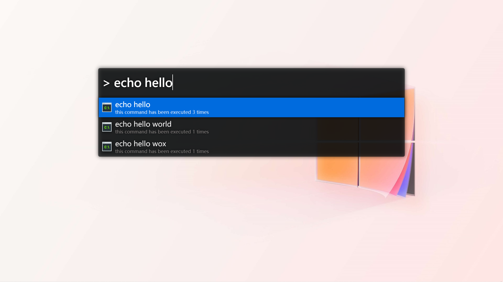
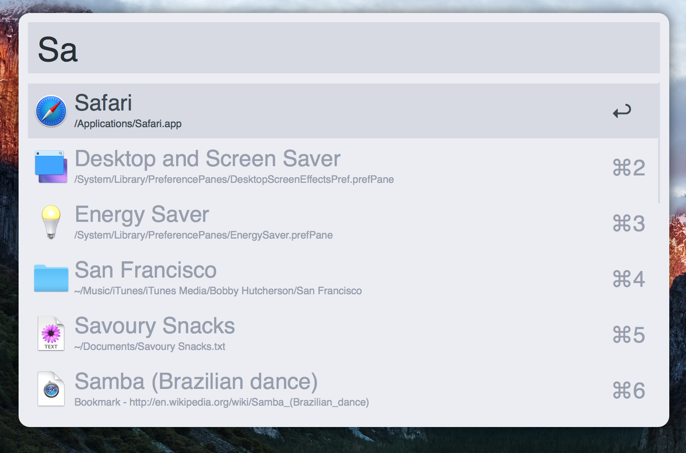

# [Wox](https://github.com/Wox-launcher/Wox) Theme Library

## [Fluent Design](https://www.microsoft.com/design/fluent/#/)

> Based on [this repo](https://github.com/gunt3001/WoxTheme-FluentLight).




## [Alfred](https://www.alfredapp.com)

> Based on [GitHub - waterzhang0423/WoxAlfredTheme: Alfred theme for Wox](https://github.com/waterzhang0423/WoxAlfredTheme)





## How to Apply

Just copy the `*.xaml` theme file(s) to your Wox's `Themes` directory.

```shell
C:\Users\user_name\AppData\Local\Wox\app-1.1.1111\Themes\FluentLight.xaml
```

> Change `user_name`, `1.1.1111` accordingly.
