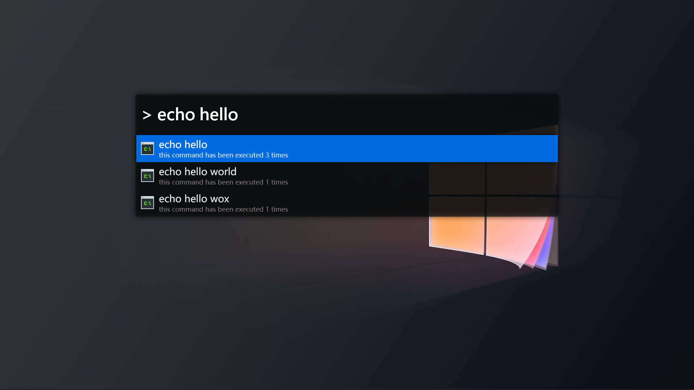

# [Wox](https://github.com/Wox-launcher/Wox) Theme Library

* [Fluent Design (PowerToys Run)](#fluent-design) <!-- TOC -->
* [Alfred](#alfred)
* [How to Apply](#how-to-apply)

> More to come!

## [Fluent Design](https://www.microsoft.com/design/fluent/#/)

> Based on [this repo](https://github.com/gunt3001/WoxTheme-FluentLight).


## [Alfred](https://www.alfredapp.com)

> Based on [this repo](https://github.com/waterzhang0423/WoxAlfredTheme)





## How to Apply

Just copy the `*.xaml` theme file(s) in this repository to your Wox's `Themes` directory:

```shell
C:\Users\user_name\AppData\Local\Wox\app-1.1.1111\Themes\
```

> Remember to change `user_name`, `1.1.1111` accordingly.

Then you can toggle these themes on in the Wox setting > themes page.
